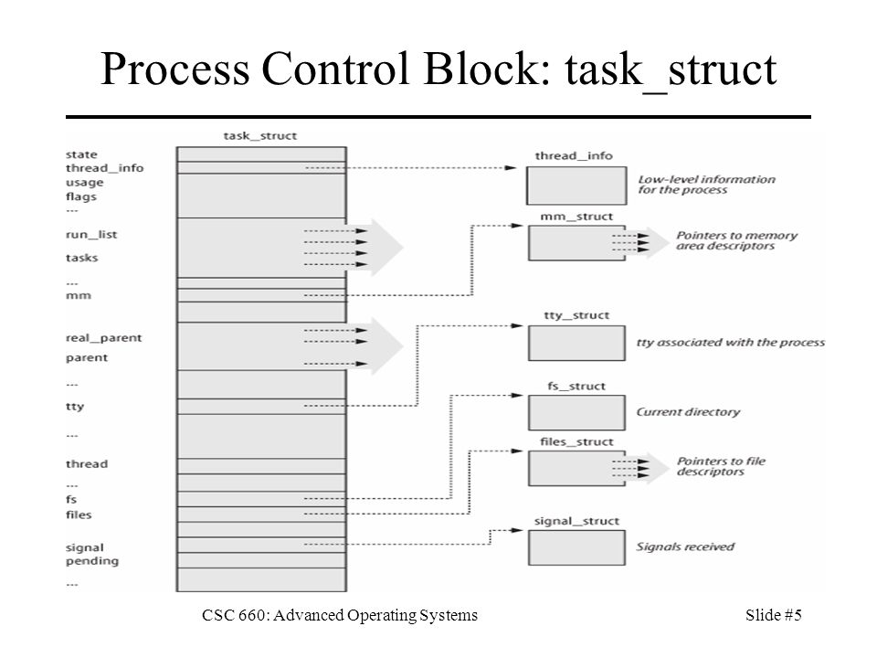
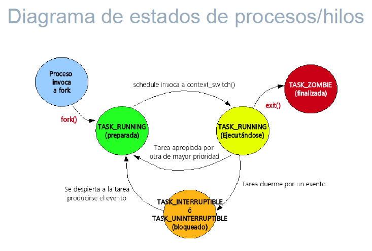
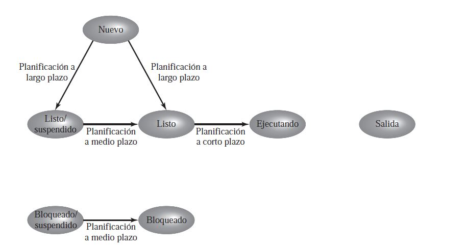
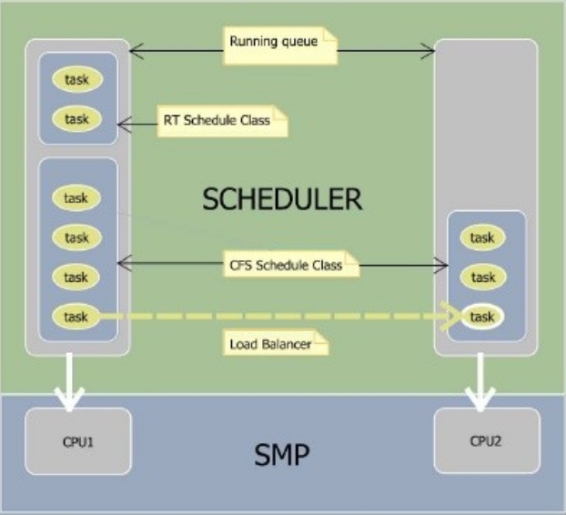
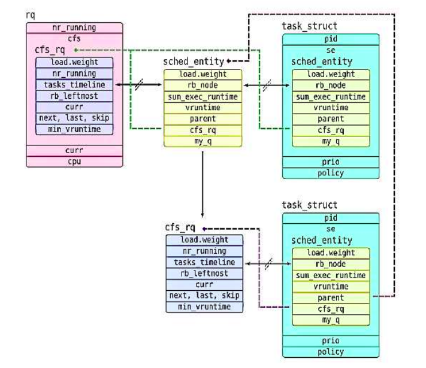
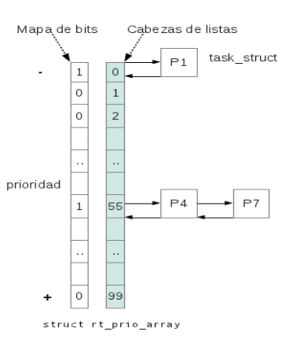
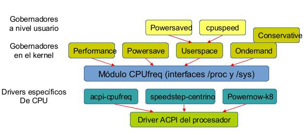
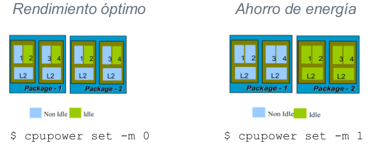

# TEMA 2: PROCESOS E HILOS.
## REPASO
##### PROCESO:
1. Programa en ejecución.
2. Instancia de un programa ejecutado en un computador.
3. La entidad que se puede asignar y ejecutar en un procesador.
4. La unidad de actividad que se caracteriza por la ejecución  de una secuencia de instrucciones, un estado actual y un conjunto de recursos del sistema asociado.
5. Entidad que consiste un número de elementos. Elementos esenciales:


 	 · Código de programa.

 	 · Conjunto de datos asociados a dicho código.

##### IMAGEN DE UN PROCESO:
1. Espacio en memoria para almacenar los distintos procesos.
2. Espacio en memoria para almacenar la **‘pila de ejecución’** (Estructura de tamaño intermedio, donde se almacenan datos temporales necesarios en un proceso.)
3. **‘Bloque de control de proceso’**, (Registro con el cual el Sistema Operativo, toma información sobre cada proceso.)

##### BLOQUE DE CONTROL DE PROCESO (PCB):

Estructura de datos asociada a un proceso que contiene la siguiente información sobre el mismo:

+ Identificador.
+ Estado.
+ Prioridad.
+ Contador de programa. 
+ Punteros a memoria.
+ Datos de contexto.
+ Información de estado de E/S. 
+ Información de auditoría. (Tiempo de procesador, o de reloj, registros contables…).

#####	ESTADOS BÁSICOS:

+ Nuevo.
+ Preparado.
+ Ejecutándose. 
+ Bloqueado.
+ Finalizado.

**Nuevo -> Preparado.** El sistema se encuentra preparado para ejecutar un nuevo proceso.

**Preparado -> Ejecutándose.** El planificador toma un proceso preparado y le cede el control de la CPU.

**Ejecutándose -> Finalizado.** El proceso ha acabado, o ha sido abortado.

**Ejecutándose -> Preparado.** Normalmente, el proceso ha agotado su tiempo de ejecución, y aun no ha acabado, por lo que debe volver a la cola de preparado.
 
**Ejecutándose -> Bloqueado.**  Un proceso se bloquea si solicita algo por lo que debe esperar.
 
**Bloqueado -> Preparado.** Un proceso bloqueado pasa a estado preparado cuando se produce el evento que estaba esperando. 
**Preparado -> Finalizado.**  Si un padre termina la ejecución de un hijo. 

**Bloqueado -> Finalizado.** Si un padre termina la ejecución de un hijo.

##### CAMBIO DE CONTEXTO:

Un cambio de contexto puede ocurrir en cualquier instante en el que el SO obtiene el control sobre el proceso actualmente en ejecución. 

1.	**Interrupciones:** Causadas por algún evento externo e independiente al proceso  actualmente en ejecución. El control se transfiere al manejador de interrupciones, que realiza determinadas tareas internas y que posteriormente salta a una rutina del SO, encargada de cada uno de los tipos de interrupciones en particular: 

	+ **Interrupción de reloj:** El SO determina si el proceso ha excedido o no la unidad máxima de tiempo de reloj (rodaja de tiempo) antes de ser interrumpido.
	+ **Interrupción de E/S:**  El SO determina qué acción de E/S ha ocurrido. Si la acción de E/S constituye un evento por el cal están esperando uno o más procesos, el SO mueve todos los procesos correspondientes al estado preparado. El SO puede decidir si reanuda la ejecución del proceso actualmente en estado Ejecutando o si lo expulsa para proceder con la ejecución de un proceso preparado de mayor prioridad.
	+ **Fallo de memoria:** El procesador se encuentra con una referencia a una dirección de memoria virtual que no se encuentra en memoria. El SO debe traer el bloque que contiene la referencia desde memoria secundaria a memoria principal. Después de que se solicita la operación de E/S para traer el bloque a memoria, el proceso que causó el fallo pasa a estado bloqueado, el SO realiza un cambio de contexto y pone a ejecutar otro proceso. Cuando el bloque solicitado sea accesible, ya en memoria principal, el proceso pasa a preparado.
2.	**Traps(Trampas):** Asociadas a una condición de error o excepción  irreversible generada dentro del proceso que se está ejecutando. 

		Si es así, el proceso en ejecución pasa a estado inicializado y se hace un cambio de contexto. 

## 1. IMPLEMENTACIÓN DE LAS ABSTRACCIONES DE PROCESO E HILO.

### BLOQUE DE CONTROL DE PROCESO

En el caso de Linux, se denomina **Descriptor de Proceso**, y viene dado por la estructura ``task_struct``.

{#id .class width=500 height=500px}


Es una estructura de datos que: 

 + Presenta subestructuras.
 
 + Define el estado del proceso.
 
 + Define los recursos que está usando.
 
	tty_struct -> Indica los dispositivos de entrada/salida asociados al proceso.
		
	files_struct -> Indica si se están usando archivos. Por defecto, siempre se utiliza esta estructura pues todo proceso tiene al menos tres archivo abiertos: Entrada estándar, Salida estándar, Salida de Error.
		
	mm_struct -> Indica el espacio de direcciones del proceso, el inicio y el final de la pila, la dirección de las librerías, etc... pero nunca el contenido.
		
	fs_struct -> Indica la dirección del directorio de trabajo actual, para que el SO busque a partir de ahí. 
		
	signal_struct -> Sistema de notificación de eventos. 
		
	thread_ info -> Información de bajo nivel. Se verá a continuación más detalladamente.
		
 

 Las subestructuras ``mm_struct`` , ``files_struct``, ``tty_struct``, y ``signal_struct`` se desgajan de la estructura principal por dos motivos:
 1. No se asignan cuando no es necesario (Por ejemplo un demonio no tiene asignada una terminal.)
 2. Permiten ser compartiadas cuando creamos hilos de un proceso. Por ejemplo, dos hilos son hermanos si comparten ``mm_struct`` (mismo espacio de usuarios).
 
### ESTRUCTURA thread_info
 
 Contiene información de bajo nivel sobre el proceso/hilo y permite acceder a la pila kernel.
 Cuando un proceso se ejecuta en modo usuario o modo supervisor, cada proceso tiene dos pilas (pila usuario y pila kernel). En el caso de linux, esta pila se almacena en ``thread_info``. De esta forma evitamos que el usuario acceda a los datos de la pila generados por el kernel.
 Una de las funciones es saber en qué CPU se está ejecutando el proceso.
 
 Campos relevantes:
 
 + Indicadores ``TIF_SIGPENDING`` y ``TIF_NEED_RESCHED``-
 + ``CPU``: número CPU en la que se ejecuta.
 + ``preempt_count``: Cuenta las veces que se le quita el control al proceso.
 
 Macros:
 
 + ``current_thread_info``: dirección de thread_info del proceso actual.
 + ``current``: dirección del descriptor del proceso actual.
 

## ESTADO DE LOS PROCESOS

El campo ``state`` del Descriptor de proceso  almacena el estado de un proceso en Linux. un proceso puede encontrarse en los siguientes estados:  
+ ``TASK_RUNNING``: el proceso es ejecutable o está en ejecución.  
+ `TASK_INTERRUPTIBLE`: el proceso está bloqueado (dormido) de forma que puede ser interrumpido por una señal. Ejemplo: Espera de entrada de teclado.  
+ ``TASK_UNINTERRUPTIBLE``: proceso bloqueado no despertable por otra señal. Ejemplo: Espera de lectura de disco que no se produce.  
+ ``TASK_TRACED``: proceso que está siendo "traceado" por otro. Ejemplo: Cuando un proceso está siendo depurado, y su ejecución se para en un punto de ruptura.  
+ ``TASK_STOPPED``: la ejecución del procesose ha detenido por alguna de las señales de control de trabajo.

El campo ``exit_state`` almacena los estados de los procesos que han finalizado:  
+ ``EXIT_DEAD``: va a ser eliminado, su padre ha invocado wait().  
+ ``EXIT_ZOMBIE``: el padre aún no ha realizado wait().  

{#id .class width=400 height=400px}


Todos los procesos menos uno, han sido creados a partir de otro. Al arrancar la máquina una de las labores es crear el primer proceso a partir del cual se crearán el resto. El primer proceso al arrancar es el `init()`


### Transiciones entre estados
+ ``clone()``: llamada al sistema para crear un proceso/hilo.
+ ``exit()``: llamada para finalizar un proceso.
+ ``sleep()``: bloquea/duerme a un proceso en espera de un determinado evento.
+ ``wakeup()``: desbloquea/despierta a un proceso cuando se ha producido el evento por el que espera.
+ ``schedule()``: planificador – decide que proceso tiene el control de la CPU

*En Linux puedes usar clone() para crear un proceso, pero en el resto de Unix no, hay que usar fork(). Cuando Linux usa fork(), llama a clone().*

### Colas de estado
Existe una lista de procesos doblemente enlazada con todos los procesos del sistema y a la cabeza está el swapper (PID=0, ``task_struct_init_task``).

Los estados ``TASK_STOPPED``, ``EXIT_ZOMBIE``, ó ``EXIT_DEAD`` no están agrupados en colas.

Los procesos ``TASK_RUNNING`` están en diferentes colas de procesos ejecutables: una cola por procesador.


### Jerarquías de procesos
Para gestionar procesos de forma conjunta, todos los procesos forman parte de una jerarquía, con el proceso: systemd / init (PID=1) a la cabeza.
Todo proceso tiene exactamente un padre.
Procesos hermanos (``siblings``) = procesos con el mismo padre.
La relación entre procesos se almacena en el PCB:

+ ``parent``: puntero al padre
+ ``children``: lista de hijos.
…

*El padre de un proceso es que lo creó, si el padre(parent) muere, a veces el creado se engancha a otro, conocido como real parent.*

## MANIPULACIÓN DE PROCESOS

Para crear un nuevo proceso necesitamos dos llamadas al sistema: fork + exec.
1) El proceso padre llama a fork(), que crea un "duplicado" del sí mismo. 
2) El propio proceso hijo invoca la llamada exec().
Exec() se encarga de ejecutar un programa dentro de un proceso existente a partir del ejecutable que se pasa como argumento. 
Al invocar a exec() el SO destruye el espacio de direcciones del proceso, solo se mantiene el descriptor de proceso y se construye un nuevo espacio de direcciones de usuario a partir de la información del formato ELF(Executable and Linkable format) del programa invocado.

Nota: En Windows, la creación de un proceso es bastante más compleja, solo la llamada necesita 6 parámetros, siendo dos de ellos estructuras de datos.

### clone();

clone(): crea un proceso o hilo desde otro con las características que se especifican en los argumentos.
El prototipo de la función en la biblioteca glibc es:

~~~
#define <sched.h>
int clone(int (*func() (void *), void *child_stack,
int flags, void *func_arg, … /*pid_t *ptid,
struct user_desc *tls, pid_t ctid */);
~~~
+ El modelo de hilos de Linux es 1:1. Esto significa que un hilo a nivel usuario genera un hilo a nivel kernel (hebra). Todos los hilos usuario son validos para el kernel, por lo que son planificables de forma independiente.
+ clone() es una llamada endémica de Linux, en sistemas UNIX, la llamada para crear procesos (no hilos) es fork(), como ya hemos visto. 
En Linux, fork() se implementa como:

~~~
clone(SIGCHLD,0)
~~~

+ El prototipo de la llamada al sistema clone() es **clone(flags, stack, ptid, ctid, regs).

**FLAGS:**

+ CLONE_FILES.- hilo padre e hijo comparten los mismos archivos abiertos. 
+ CLONE_FS.- padre e hijo comparten la información del sistema de archivos. 
+ CLONE_VM.-  padre e hijo comparten el mismo espacio de direcciones. (MM_STRUCT)
+ CLONE_SIGHAND.- comparten los manejadores de señales y señales bloqueadas.
+ CLONE_THREAD.- el padre y el hijo pertenecen al mismo grupo. 

Si preguntamos a la hebra por su identificador nos dará el identificador del grupo, si queremos el TID, necesitamos usar una macro SYSCALL, pues no tenemos una llamada en la librería para conseguir esa información. 

**¿CÓMO FUNCIONA clone()?**

1. dup_task_struct: copia el descriptor del proceso actual (task_struct, pila y thread_info).
2. alloc_pid: le asigna un nuevo PID
3. Al inicializar la task_struct, diferenciamos los hilos padre hijo y ponemos a este último en estado no-interrumpible.
4. sched_fork: marcamos el hilo como TASK_RUNNING y se inicializa información sobre planificación.
5. Copiamos o compartimos componentes según los flags.
6. Asignamos ID, relaciones de parentesco, etc.

**Observaciones:**

 + No deben aparecer juntos: CLONE_NEWNS y CLONE_FS.
 + Deben aparecer siempre juntos: CLONE_SIGHAND  con CLONE_THREAD o CLONE_VM.
 + Cuando usamos CLONE_LOQUESEA , la estructura loquesea_struct no se copia, se comparte.
 + Existe un contador de referencias que lleva el conteo de número de hilos que comparte un proceso. Si el contador llega a 0, no habrá más estructuras compartidas, por lo tanto, el proceso se libera.
 
**Actividad Propuesta: 
Sabiendo esto:
CLONE_VM|CLONE_FILES|CLONE_FS|CLONE_THREAD|
CLONE_SIGHAND
¿Qué estructuras comparten el padre y el hijo?**

Comparten todas (mm_struct, files_struct, fs_struct, signal_struct, tty_struct) menos el thread_info. Recordemos que cuando se usa clone(), el proceso hijo pasa a estado no-interrumpible, mientras que el padre se está ejecutando, por lo tanto, sus thread_info, son distintos.

### Hilos kernel

Son hilos que no tienen espacio de direcciones de usuario. Por tanto, su descriptor tiene `task_struct->mm=NULL`. Realizan labores de sistema (sistuyendo a los demonios de Unix)  Para crearlos, debemos hacerlo desde otro hilo kernel con la funcion `kthread_create()`.

### Terminar un proceso

* Involuntariamente: recibe una señal, y se aplica la acción por defecto, que es terminar.

* Voluntariamente: se utiliza `exit()` o `return()` que finalizan el proceso primero a nivel de biblioteca, o utilizando directamente `_exit()` (llamada al SO) que no da la oportunidad de finalizar el proceso a nivel de biblioteca.

### Exit()
El objetivo de `do_exit()` es borrar todas las referencias del proceso. Sigue estos pasos:

* Activa `PF_EXITING` (bandera que notifica que el proceso va a terminar)

* Decrementa los contadores de uso de *mm_struct*, *fs_struct* y *files_struct*.  Si estos contadores alcanzan el valor 0, se liberan los recursos.

* Ajusta el *exit_code* del descriptor, que será devuelto al padre, con el valor pasado al invocar a *exit()*. 

* Envía al padre la señal de finalización; si tiene algún hijo le busca un padre en el grupo o el initi, y pone el estado a *TASK_ZOMBIE*.

* Invoca a `schedule()`para ejecutar otro proceso.

Solo falta liberar la pila kernel, el *thread_info* y *task_struct* para que el padre pueda recuperar el código de finalización, para ello se invoca a `wait()`


### wait()

Llamada que bloquea a un proceso padre hasta que uno de sus hijos finaliza; cuando esto ocurre, devuelve al llamador el PID del hijo finalizado y el estado de finalización.

Esta función invoca a `release_task()` que:

* Elimina el descriptor de la lista de tareas.

* Si es la última tarea de su grupo, y el líder está zombi, notifica al padre del líder zombi.

* Libera la memoria de la pila kernel, *thread_info* y *task_struct*


---
## 3\. Planificación de la CPU

El planificador asigna los procesos a ser ejecutados por el procesador/es a lo largo del tiempo, de forma que se cumplan los objetivos de tiempo de respuesta, rendimiento y eficiencia del procesador. 

### Tipos de planificador:
* **Planificador a largo plazo:** Es el que toma la decisión de añadir un nuevo proceso al conjuntos de procesos a ser ejecutados. Es decir, toma un programa o trabajo y lo convierte en un proceso que lo añade a la cola de procesos de "listo" del planificador a corto plazo. En algunos sistemas, en vez de pasar directamente a la cola de "listo", pasa primero a la zona de intercambio, es decir, se añaden a la cola del planificador a medio plazo.

* **Planificador a medio plazo:** Es parte de la función de intercambio. Toma la decisión de añadir  un proceso al número de procesos que están parcialmente o totalmente en la memoria principal. (La verdad es que de este no me he entardo muy bien, pero con la ilustración, se pilla la idea aprox.)

* **Planificador a corto plazo:** Es el 'scheduler' y es el que se ejecuta con más frecuencia. Dedice qué proceso de entre la cola de procesos 'listos' ejecutar el siguiente. Este planificador se invoca siempre que ocurre un evento que conlleva el bloqueo del actual, y da la oportunidad ejecutar otro. El criterio con el que se elige el siguiente proceso, dependerá del algoritmo de planificación que se utilice.

Ilustrativamente:




Podemos distinguir dos tipos de planificación según la política de expulsión:

* **Planificación no apropiativa (nonpreemptive):** *"Sin expulsión".* Una vez que el proceso está ejecutándose, continúa ejecutándose hasta que termine o se bloquee para esperar una E/S o solicitar un servicio al sistema operativo. Es decir, al proceso actual no se le puede retirar la CPU. Estos se han utilizado como mecanismo de grano grueso de sincronización en modo kernel.

* **Planifcación apropiativa (preemptive):** *"Con expulsión".* Un proceso que está ejecutándose puede ser interrumpido y pasar al estado de listo. Esta decisión puede ser tomada cuando: se crea un nuevo proceso, un proceso pasa de bloqueado a listo o por interrupciones de reloj. Los kernel de tiempo-real necesitan ser apropiativos.
 
### Algoritmos de planificación:

* **FIFO - First in, first out**

Los procesos pasan al estado listo se unen a la cola. Cuando el proceso que está en ejecución deja de ejecutar, se selecciona el proceso que más lleva en la cola para pasar a ejecutando.

Un inconveniente es que si un proceso corto está detrás de uno largo, el corto tendrá que estar mucho rato esperando para poder ejecutarse en comparación con lo que tarda en ejecutarse. Además, otro problema se presenta cuando un proceso que está limitado por el procesador está ejecutándose, ya que el resto debe esperar, y probablemente los procesos que estaban esperando una E/S pasarán de bloqueados a listos en ese tiempo, dejando los dispositivos de E/S ociosos (sin usar), aunque haya posible trabajos que puedan realizar.  Cuando el proceso limitado por la CPU deja de ejecutarse, los procesos que necesitaban E/S se ejecutarán y pueden volverse
a bloquear por la necesidad de E/S. Esto hace que el uso del procesor de los dispositivos de E/S sean ineficientes.


* **Prioridades**

A cada proceso se le asigna una prioridad. En lugar de una sola cola de procesos listos, se proporciona un conjunto de colas en orden decreciente de prioridades: CL0, CL1, ... , CLn. Cuando se va a elegir un proceso para la ejecución, se empieza por la prioridad más alta CL0, y se elige un proceso de esa cola utilizando otro de los algoritmos de planificación. Si está vacía se pasa a CL1 y así sucesivamente. 

Un problema es que los procesos de prioridad baja puede que no lleguen a ejecutarse. (pueden sufrir inanición).


* **Round robin**

Una forma de reducir el "castigo" de los procesos cortos en FIFO es usando este algoritmo. Se genera una interrupción cada cierto intervalo de tiempo, donde el proceso actualmente en ejecución pasa a listo y segun FIFO se selecciona el siguiente.

Los intervalos de tiempos que se usan se llaman *quantum*, es necesario comentar que si el quantum es muy pequeño se puede producir una sobrecarga de procesamiento, ya que a los procesos no les da tiempo a hacer nada en ese tiempo y siempre necesitarán mas de un quantum. Si en cambio el queantum es muy grande se degenera a un FIFO. Lo ideal es que sea ligeramente mayor al tiempo requerido por una interrupción.

Una desventaja es que los procesos que necesitan E/S se bloquean antes de tiempo y tienen que pasar a bloqueados, mientras que los que tienen limitado el procesador usan siempre todo el quantum, por lo que hay una desigualdad en la distribución de tiempo.

* **SPN - shortest process next**

Es una política no apropiativa que elige en proceso con el tiempo de procesamiento más corto.

Un problema es la necesidad de estimar el tiempo de ejecución de cada proceso. (En Stalling hay muchas formulitas de como lo hace, pero no me suena de que se haya ni siqueira nombrado este algoritmo en clase por lo que lo veo innesario)

Otro problema es la iniciación que pueden sufrir lo procesos más largos.

* **SRT - shortes remaining time**

Es la versión apropiativa de la SPN. Si durante la ejecución de un proceso, se crea uno nuevo que tiene menos tiempo de ejecución restante que el que se está ejecutando, se pasa el actual a listo y se ejecuta el nuevo.

* **Mayor tiempo de tasa de respuesta**

Se van eligiendo según el tiempo de estancia normalizado, que es la tasa entre el tiempo de estancia y el tiempo actual de servicio.

* **Retroalimentación - feedback**

Da preferencia a los procesos más cortos penalizando a los que han estado ejecutandose más tiempo. Para ello se realiza una planificación apropiativa por interrupciones (la version apropiativa del de prioridades).
Cuando un nuevo proceso entra al sistema, se le situa en CL0 (cola con mayor prioridad). Al expulsarlo se le devuelve a listo
pero en la cola CL1, cada vez que es expulsado va a una cola menor. Los procesos cortos terminarán pronto, ya que no tendrán que irse muy atrás en las colas, mientras que los largos se degradan gradualmente. En cada cola se elige según FIFO. En la cola con menor prioridad, el proceso no puede descender más, por lo que vuelve a la misma cola, convirtiendose esta cola en un round robin.

Los procesos largos pueden alargarse demasiado, en especial si no paran de entrar procesos cortos. Una solución es compensar los tiempos de expulsión, la cola CL0 tendrá un quantum de una unidad de tiempo, el CL1 de dos unidades, y así hasta CLn que tendra 2<sup>n </sup> unidades de t tiempo antes de ser expulsado.

Nota: tambien puede ser llamado como retroalimentación multinivel.

### Proceso nulo

Este proceso se crea para siempre haya un proceso que el planificador a corto plazo que pueda encontrar un proceso en preparados para ejecutar. Por tanto, este proceso siempre está listo para ejecutarse y tiene la prioridad más baja.

**Implementación** 
Gracias al proceso nulo, la implementación del planificador a óptima, y quedaría así:

``` cpp
Planificador(){
  while (true){
	Selecciona(Pj)

  Cambio contexto(Pi,Pj)
}

```

Podemos hacerlo así ya que siempre hay un proceso nulo que podemos seleccionar, si no lo hubiera tendríamos que añadir un `if(cola_preprados==vacia) halt; else Selecciona (Pj)`, por lo que teniendo en cuenta que llamamos a planificar muchas veces, quitar un if genera más eficacia.

*Insertar parte de Carmen*


### Clases de Planificación:

+ Dado que Linux, como sabíamos, debía ser capaz de soportar tres clases de planificación (2 de tiempo real y una de tiempo compartido), éste es el que se encarga ahora de manejar la información entre el planificador genérico y los planificadores separados. 
+ Cada instancia de la estructura del computador se encarga de una clase de planificación (tiempo-real, tiempo compartido...etc).
+ Forman una jerarquía plana y “rígida” que determina el orden de ejecución:  
	**PROCESOS TIEMPO-REAL >> PROCESOS CFS >> PROCESOS IDLE**
+ Esta jerarquía se produce en compilación, no se puede cambiar de forma dinámica (en ejecución).

Recordar que cada proceso se encuentra en una única cola, su rq(runnning queue o run queue), dependiendo de la clase de planificación asignada a ese proceso. Además, cada procesador tiene su propia cola para mayor eficiencia. De la lista general, se pasa a una cola con prioridad para cada procesador. Más abajo aparece un dibujo explicativo (2).

Algunos sistemas operativos, en su rango de valores para prioridades de procesos, éste se parte en tres para cada clase de planificación. Si el rango es de 0-120, pues, por ejemplo 0-40 sería para tiempo-real, 40-80 para CFS... etc.

{#id .class width=400 height=400px}

### Estructura que define una entidad y sus relaciones

Equilibrio de carga.

+ Nodo en árbol rojo-negro.
+ Bool si la entidad está en una cola de ejecución
+ Tiempo de inicio de la ejecución
+ Tiempo consumido de CPU en últ ejecución
+ Valor salvado de sum_exec_start ( ) al quitarle control de la CPU.

En orden, las correspondientes funciones en LINUX:

~~~
struct sched_entity {
	struct load_weight load;	/*para equilibrio de carga*/
	struct rb_node run_node;	/*nodo de arbol rojo-negro*/
	unsigned int on_rq;			/*indica si la entidad esta planificada en una cola*/
	
	u64 exec_start;				/* tiempo inicio ejecución */
	u64 sum_exec_start;			/*t consumido de CPU*/
	u64 vrtime;					/*tiempo virtual */
	u64 prev_sum_exec_runtime; /* valor salvado de sum_exec_start al quitarle control CPU*/
	. . .
};
~~~

Tabla que muestra las relaciones entre las entidades (recordar estos conceptos de B. de Datos de FS):

{#id .class width=400 height=400px}


### Política de planificación

Como ya hemos mencionado antes, los sistemas operativos utilizan un intervalo de números enteros para asignar prioridad a los procesos. En el caso de Linux es [-20,19], con orden inverso eso sí, algo común en prioridades. Cuanto menor es el valor de la prioridad, mayor prioridad tiene.

Por ejemplo, sin ser root sólo se puede cambiar la prioridad de un proceso a un número positivo, y se reservan los negativos a puntos críticos del sistema o más sensibles a fallos por una mala planificación.

La política de planificación es:
+ Se seleccionan en orden creciente de prioridad.
+ A igualdad de prioridad, el que lleve más tiempo esperando.
+ Los procesos de clase FIFO se ejecutan hasta el final o hasta que se bloquee.

### Tipos de planificadores

**Planificador periódico**

+ Se invoca con frecuencia en HZ. También se puede ver como que su periodo es un número fijo de ciclos dee reloj.
+ Dos funciones principales: Manejar estadísticas relativas a planificación. Activar el planificador periódico de la clase de planificación del proceso actual, así le cede la toma de decisiones al planificador de la clase.

**Planificador principal:**

+ La función schedule() se implementa en varios sitios de código del kernel para cambiar de proceso.
+ Cuando volvemos de una llamada al sistema, comprobamos si hay que replanificar. De eso también se encarga schedule().

### Planificador: Algoritmo

1. Seleccionar la cola y el proceso actual:

~~~
rq=cpu_rq(cpu);
prev=rq->cur;
~~~

2. Desactivar la tarea actual de la cola.

~~~
desactivate_task(rq, prev, 1);
~~~

3. Seleccionar el siguiente proceso a ejecutar.

~~~
next=pick_next_task(rq, next);
~~~

4. Invocar el cambio de contexto.

~~~
if(likely(prev != next)
	context_switch(rq, prev, next);
~~~

5. Comprobar si hay que replanificar.

~~~
if (need_resched())
	goto need_resched;
~~~

## PLANIFICADOR CFS

### Pesos de Carga:

La importancia de un proceso viene dada por su prioridad, o por su peso de carga (load weight). Cuanto mayor sea el peso de carga de un proceso mayor será su prioridad (menor será la prioridad asignada con la orden `nice`). 
Cada nivel de prioridad con la orden nice equivale a un 10% de apropiación de la CPU, luego al disminuir un nivel obtienes 10% más de CPU, y viceversa.
El kernel convierte prioridades a peso de carga con la función `prio_to_weight()`. Los cálculos se realizan con la función `set_load_weight()` . 

El % de CPU que obtiene un proceso se calcula:  
`% de CPU del proceso i = Peso del proceso i  / \[\sum_{j=1}^nPeso del proceso j\]`

### Ejemplo de uso:

Dados dos procesos, P1, P2, ambos con la misma prioridad (`nice` = 0), y por tanto, el mismo peso, 1024, obtenemos:

```
% de CPU de P1 : 1024 / 1024 + 1024 = 50% CPU
% de CPU de P2 : 1024 / 1024 + 1024 = 50% CPU
```

Si P2 decrementa su prioridad con nice = 1, subiendo así de nivel, decrementa su uso de CPU un 10%: 

`Peso actual de P2 : 1024 / 1.25 = 1024 * 0.8 = 819.2 ⋍ 820` 

El 0.8 se obtiene: 

`% Peso a quitar = % a restar * nº procesos existentes = 10% * 2 = 20%`

Luego me quedo con el 80% del peso inicial del proceso.
Así, el % de CPU asignado a cada uno es: 

```
% de CPU de P1 : 1024 / 1024 + 820 ⋍ 55.53% CPU
% de CPU de P2 : 820 / 1024 + 820 ⋍ 44.47% CPU
```

Como podemos ver, ahora el proceso P2 tiene un 10% menos de CPU del que disponía antes (el 10% de 50 es 5, luego 50-5=45%)

### Clase CFS:

CFS (*Completely Fair Scheduler*) intenta modelar un procesador multitarea perfecto. Este algoritmo tiene como objetivo el maximizar el uso de la CPU pero permitiendo el uso interactivo de la máquina, es decir, tratará de que en ningún momento un usuario vea una bajada de rendimiento. 

El CFS no asigna rodajas de tiempo, sino que asigna una proporción del procesador dependiente de la carga del sistema.
El tiempo del que dispone un proceso para usar la CPU es:  
`
Tiempo de CPU del proceso i = [ Peso del proceso i  / \[\sum_{j=1}^nPeso del proceso j\] ] * P  
`  
Siendo P la latencia de planificación, que es el tiempo mínimo que se le va a asignar a un proceso, si el nº de procesos es mayor a `nr_latency`, en otro caso, P es `min_granularidad*n`, siendo n el nº de procesos y `min_granularidad` el mínimo tiempo asignado a cada proceso, ya que si n tiende a infinito, el tiempo asignado a cada proceso tiende a cero, por lo que es necesario definir dicha variable.

En la implementación actual, `sched_latency`=8 (latencia de planificación), `nr_latency`=8, y `min_granularity`= 1 us.

La clase CFS está definida en `kernell/sched_fair.c`.

### Tiempo asignado a un proceso:

Como la carga es dinámica, para el cálculo del tiempo asignado se usa un periodo:  
5 o menos procesos: 20 ms  
Sistema cargado: 5 ms más por proceso  
`Tiempo asignado = ( Longitud del periodo * peso ) / peso rq `

### Ejemplo:

Dados tres procesos, P1, P2, P3, tal que:  
P1: Nice = 5, Peso = 335  
P2: Nice = 0, Peso = 1024  
P3: Nice = -5, Peso = 3121  
```
Tiempo asignado a P1 = ( 20 * 335 ) / 4550 ⋍ 1.47 
Tiempo asignado a P2 = ( 20 * 1024 ) / 4550 ⋍ 4.5 
Tiempo asignado a P3 = ( 20 * 3121 ) / 4550 ⋍ 13.72
```
### Selección de proceso:

El tiempo virtual de ejecución (`vruntime`) es el tiempo de ejecución real normalizado por el número de procesos en ejecución. Este tiempo es gestionado por `update_curr()` definida en `kernel/sched_fair.c`. 
CFS intenta equilibrar los tiempos virtuales de ejecución de los procesos de tal manera que se elige siempre el proceso con `vruntime` más pequeño.

La cola de ejecución de CFS es un árbol rojo-negro, un árbol de búsqueda binaria autoequilibrado donde la clave de búsqueda es `vruntime`. En el árbol rojo-negro, el proceso con el menor vruntime es el que está más a la izquierda.

### Parámetros de planificación:

Lista de las variables relacionadas con planificación:   
	`% sysctl -A|grep "sched"|grep -v "domain"`  
Valor actual de las variables ajustables:  
	`/proc/sched_debug`  
Estadísticas cola actual:  
	`/proc/schedstat`  
Información planificación proceso PID:  
	`/proc/<PID>/sched`

## Planificador de tiempo-real
Los procesos de tiempo-real ejecutables que existan en el sistema se ejecutarán antes que el resto, salvo que exista uno con mayor prioridad. Los algoritmos de planificación de tiempo real dependen de:
1. Cuándo el sistema realiza análisis de planificabilidad.
2. De hacerlo, si se realiza estática o dinámicamente
3. El resultado del análisis produce un plan de planificación acorde al cual se desarrollarán las tareas en tiempo de ejecución.

{#id .class width=300 height=400px}


El *mapa de bits* permite seleccionar la cola con procesos en 2 (64 bits) o 4 (32 bits) instrucciones en ensamblador.

## Planificado en sistemas multipocesadores
En los sistemas multipocesador más tradicionales, los procesos no se vinculan a los procesadores. Hay una única cola para todos los procesadores o, si se utiliza algún tipo de esquema basado en prioridades, hay múltiples colas basadas en prioridad, alimentando a un único colectivo de procesadores. Puede verse como una arquitectura de colas multiservidor. A la hora de planificar, hay que considerar algunos aspectos:
1. Compartición de la carga de CPU imparcial
2. Afinidad de una tarea por un procesador
3. Migración de tareas sin sobrecarga.

En resumen, se realiza igual que en monoprocesadores, pero se tiene en cuenta el número de CPUs, la asignación y la liberación de proceso y procesador.

## Gestión de la energía
En los diseños actuales es importante considerar la gestión de la potencia, con el objetivo de reducir los costes de consumo de energía y los costes de refrigeración. Esta gestión se realiza a dos niveles:
* Nivel de CPU: P-states, C-states y T-states.
* Nivel de SO: CPUfreq (paquetes cpufrequtils y cpupower) y planificación.

Los procesadores actuales pueden funcionar a diferentes voltajes. A mayor voltaje, más alta es la frecuencia de funcionamiento y por tanto, mayor rendimiento. Cuando hay carga máxima del sistema, el procesador aumenta el voltaje para incrementar la frecuencia y por el contrario, cuando está ocioso (poca carga de trabajo), la disminuye para ahorrar energía.

### Especificación ACPI
Todos los procesadores actuales cumplen la especificación ***Advanced Configuration and Power Interface***, que se define como la especificación abierta para la gestión de potencia y gestión térmica, controladas por el SO. Se definen cuatro estados Globales (*G-Estados*):
* G0: estado de funcionamiento (estados-C y estados-P)
* G1: estado dormido (S-estados)
* G2: estado apagado soft
* G3: estado apagado mecánico

### Estados de la CPU.
* S-estados: (dormidos en G1). Van de S1 a S5. Son estados en los que se van apagando diferentes componentes del ordenador, empezando por los que más consumen.
* C-estados: son los estados de potencia en G0.C0 (activo), C1(halt), C2(stop), C3(deep sleep)... 
* P-estados: el voltaje del procesador se modifica a escalones, no de forma continua. Por, ejemplo, pasar de 5V a 3V. Éstos dependen del procesador.
* T-estados: son los conocidos como *estados throttles*. Estań relacionados con la gestión técnica, como estabilizar la temperatura, pero no se dedican a la gestión de energía. Introducen ciclos ociosos.

### Estructura CPUfreq
* El **subsitema CPUfreq** es el responsable de ajustar explícitamente la frecuencia del procesador.
*  Es una estructura modularizada que separa políticas (gobernadores) de mecanismos (*drivers* específicos de CPUs).



#### Gobernadores
Permiten gestionar la potenciar en base a unos criterios. Es decir, según el gobernador que estemos utilizando, la gestión se hará de una determinada manera. Son los siguientes:

* **Perfomance** - mantiene la CPU a la máxima frecuencia posible
  dentro de un rango especificado por el usuario
* **Powersave** - intentan ahorrar energía, manteniendo la CPU a la
  menor frecuencia posible dentro de un rango
* **Userspace** -exporta la información disponible de la frecuencia a
  nivel usuario (sysfs) permitiendo su control al mismo. Permite a
  cualquier espacio de programa de usuario ajustar la frecuencia del
  procesador. Es el que más libertad dar para ajustar la velocidad del
  procesador. Más información en
  https://www.ibm.com/support/knowledgecenter/en/linuxonibm/liaai.cpufreq/TheUserspaceGovernor.htm
* **On-demand** - ajusta la frecuencia dependiendo del uso actual de
  la CPU.
* **Conservative** - funciona al igual que el *on-demand*, pero los
  ajustes son menos agresivos.

Existen una serie de herramientas para la gestión de energía y potencia del sistema, como cpufreqtils, cpupower, powerTop y TLP.

### Planificación y energía. Algoritmos
* En CPM (procesador multinúcleo) con recursos compartidos entre núcleos de un paquete físico, el rendimiento máximo se obtiene cuando el planificador distribuye la carga equitativamente entre todos los paquetes.
* En CPM sin recursos compartidos entre núcleos de un mismo paquete físico, se ahorrará energía sin afectar al rendimiento si el planificador distribuye primero la carga entre núcleos de un paquete, antes de buscar paquetes vacíos.

El administrador puede elegir entre dos algoritmos de planificación, bien optar por un rendimiento óptimo del sistema (y por tanto, mayor consumo de energía) o bien priorizar el ahorro de energía sobre el rendimiento. Se realiza modifricando las entradas *sched_mc_power_saving* y *sched_smt_power_saving*.

* Si se opta por rendimiento óptimo, el gestor asigna cada hebra de proceso a un núcleo, teniendo así una sola hebra por núcleo. De esta forma no hay colisión entre hebras, aumentando la velocidad al no haber colisión entre cachés.
* En el modelo de ahorro de energía se colocan dos hebras en cada procesador, pudiendo así apagar alguno de los procesadores para ahorrar energía.

Por ejemplo, en un procesador quad-core (4 núcleos) ponemos cada hebra en un núcleo. Al estar todos los procesadores trabajando, aumenta el rendimiento, pero tmabién el consumo. Si optamos por ahorrar energía, el gestor coloca dos hebras en cada núcleo, quedando, por tanto, dos núcleos libres, que se apagan para ahorrar energía. Como desventaja, al tener dos núcleos con dos hebras cada uno, el rendimiento disminuye.



## Grupos de control  
El planificador trata con ***entidades planificables***, cada una de las cuales es un proceso o un grupo de procesos (tareas). El tiempo de CPU se reparte entre las distintas entidades, a cada una se le asigna un porcentaje de tiempo de CPU y gracias al planificador sabemos que se va a respetar este tiempo.  
Cada entidad tiene un determinado tiempo asignado y este a su vez se reparte equitativamente entre todas las tareas de la entidad. Por ejemplo, si la entidad tiene el 30% de la cpu cada proceso de esta tendrá un 10% de la CPU.
Esto permite definir grupos de planificación (los cgroups): Diferentes procesos se asignan a diferentes grupos. El planificador reparte la CPU imparcialmente entre grupos, y luego entre procesos de un grupo. Así, se reparte imparcialmente la CPU entre usuarios.

Un ***grupo de control*** (abreviado como cgroup) es una colección de procesos que están vinculados por los mismos criterios y asociados con un conjunto de parámetros o límites. Estos grupos son jerárquicos, lo que significa que cada grupo hereda los límites de su grupo padre.  Definen jerarquías en las que se agrupan los procesos de manera que un administrador puede determinar con gran detalle la manera en la que se asignan los recursos  o llevar la contabilidad de los mismos. El kernel proporciona acceso a múltiples controladores (también llamados subsistemas) a través de la interfaz cgroup; por ejemplo, el controlador "memory" limita el uso de la memoria, "cpuacct" contabiliza el uso de CPU, etc. Gracias a los cgroups los recursos de hardware se pueden dividir adecuadamente entre tareas y usuarios, aumentando la eficiencia general.

**Los grupos de control suministran un mecanismo para**:  
**Asignar/limitar/priorizar recursos**: CPU, memoria, y dispositivos.  
No sólo podemos limitar el acceso a CPU como hemos visto sino también a otros recursos como memoria y dispositivos de E/S.  
**Contabilidad**: medir el uso de recursos.  
Contabilizar el uso de recursos para obtener estadísticas de los mismos.  
**Aislamiento**: espacios de nombres separados por grupo.  
**Control**: congelar grupos o hacer checkpoint/restart. Permite congelar una máquina virtual y restaurarla posteriormente.  
**de una colección de procesos.**  

Los Cgroups están organizados jerárquicamente, como los procesos. La diferencia fundamental es que pueden existir muchas jerarquías diferentes de cgroups simultáneamente en un sistema, mientras que  en el modelo de proceso de Linux hay un único árbol de procesos. El modelo de cgroup es uno o más árboles de tareas separados e inconexos .
Se necesitan múltiples jerarquías separadas de cgroups porque cada jerarquía está conectada a uno o más subsistemas.

Un *subsistema* (también llamado *controlador de recursos* o simplemente controlador) representa un único recurso, como el tiempo de CPU o la memoria. La definición de un subsistema es bastante general: es algo que actúa sobre un grupo de tareas, es decir, procesos.

### Subsistemas disponibles:

* **blkio**: este subsistema establece límites en el acceso de entrada y salida hacia y desde dispositivos de bloques, como unidades físicas (disco, USB).  
* **CPU**: este subsistema usa el planificador para proporcionar el acceso de las tareas de un cgroup a la CPU.   
* **cpuset**: este subsistema asigna CPUs individuales (en un sistema multinúcleo) y nodos de memoria a tareas en un cgroup.  
* **cpuacct**: este subsistema genera informes automáticos sobre los recursos de la CPU utilizados por las tareas en un cgroup.   
* **Freezer**: suspende o reanuda las tareas en un cgroup.  
* **Dispositivos (devices)**:  permite o niega el acceso a los dispositivos a las tareas en un cgroup.  
* **Memoria (memory)**: este subsistema establece límites en el uso de memoria por las tareas de un cgroup y genera informes automáticos sobre los recursos de memoria utilizados por esas tareas.  
* **net_cls**: etiqueta paquetes de red con un identificador de clase (classid) que permite al controlador de tráfico (tc) identificar los paquetes originados en una tarea de un grupo.  
* **ns**: el subsistema del espacio de nombres.

El subsistema "ns" se agregó en el desarrollo de cgroups para integrar espacios de nombres y grupos de control. Si el cgroup "ns" estaba montado, cada espacio de nombres también crearía un nuevo grupo en la jerarquía de cgroup. Este fue un experimento que luego se consideró que no era adecuado para la API de cgroups y se eliminó del kernel.

### Los grupos de control se pueden usar de múltiples maneras:

+ Accediendo manualmente al sistema de archivos virtual (seudo-sistema de archivos) cgroup (groupsfilesystem).
+ Creando y administrando grupos sobre la marcha usando herramientas como cgcreate, cgexec y cgclassify de la librería libcgroup que permiten crear un grupo de control, ejecutarlo, clasificarlo, etc.  
El problema de estas dos formas de uso es que no son persistentes en el tiempo, es decir, cuando apago la máquina se pierde la configuración. Si queremos que sea persistente utilizamos:  
+ el "rules engine daemon" (demonio engine rules) que puede mover automáticamente procesos de ciertos usuarios, grupos o comandos a cgroups como se especifica en su archivo de configuración. Es una hebra kernel que lee un archivo de configuración donde se establecen los grupos de control y los límites de cada grupo (de CPU, memoria,…) que se deseen. El demonio lee el archivo de configuración cuando se arranca la máquina y crea los cgroups que en él se indican. Como el fichero se mantiene entre arranques del sistema la configuración de los cgroups es persistente.
+ Indirectamente a través de otro software que usa cgroups, como Docker, virtualización de Linux Containers (LXC), libvirt, systemd, Open Grid Scheduler / Grid Engine,y lmctfy de Google. No se controlan  los cgroups directamente sino a través de este software que actúa sobre los grupos de control.

### Para gestionar los grupos de control con el primer método hacemos lo siguiente:

1. Primero monto un subsistema como si fuera un sistema de archivos (el sistema de archivos que vamos a montar es cgroup). Los subsistemas se habilitan como una opción de montaje (-o subsistema que queremos controlar) de cgroupfs:  
`mount -t cgroup -o$subsistema`
2. Habilitamos los archivos del subsistema en cada cgroup (creando un directorio):  
`/dev/cgroup/migrupo/subsysA.optionB`
3. Cuando los tenemos definidos podemos verlos en `/proc/cgroups` (aquí están los grupos que se han definido y cómo están configurados)  
4. En Ubuntu, podemos instalarlo con  
`$ sudo aptitude install cgroups-bin libcgroup1`
5. Esto nos monta por defecto los siguientes fs:  
`$ ls -l /sys/fs/cgroup  
cpu cpuacct devices memory`  
+ Podemos ver los grupos de control con `cat /proc/cgroups`  

**Ejemplo**: crear dos grupos para asignar tiempo de CPU (tenemos dos aplicaciones, navegadores y reproductores de música. El navegador puede necesitar menos consumo de cpu que los reproductores de música por ello le asignamos menos tiempo de cpu):  
Creamos el correspondiente subdirectorio en sys/fs/cgroup/cpu:  
`$ mkdir Navegadores; mkdir multimedia`  
Asignamos el porcentaje de cpu al grupo escribiendo en el archivo cpu.shares.  
Escribimos el peso 2048, que es el que le vamos a dar al grupo de los reproductores de música, en este fichero:  
`$ echo 2048 > /sys/fs/cgroup/cpu/multimedia/cpu.shares`  
A los navegadores le asignamos la mitad del peso anterior:  
`$ echo 1024 > /sys/fs/cgroup/cpu/multimedia/cpu.shares`  
Movemos una tarea al cgrupo escribiendo su PID en el archivo tasks.  
`Firefox&`   
Miro el Pid del navegador con echo $! y lo escribo en el fichero tasks. Los procesos cuyo pid aparezca en este fichero consumirán la mitad de cpu que los que escribamos en el otro fichero  
`echo $! > /sys/fs/cgroup/cpu/navegadores/tasks  
mplayer micancion.mp3&`   
Los procesos en este fichero consumen más cpu que los del grupo navegadores. El planificador garantiza que tienen le doble de cpu.  
`echo $! > /sys/fs/cgroup/cpu/multimedia/tasks`  

